I've been working on projects that aim to be as inherently responsive as possible to help our customers avoid the headaches of supporting many devices.

As a result, I've learned the value of a systemized approach to responsive design. So today, I will talk about how that differs from the common understanding of responsive design and some other things I've learned.

I'll be talking more abstractly and not very specifically about the code, so hopefully, there's something for everyone here.

So... I'll start with a definition.


Responsive web design is a technique for making web pages look good on a variety of devices and screen sizes.


When you start learning about responsive design, slightly fuzzy definitions like this are usually the kind of thing you'll see.

This seems straightforward, so let's unpack this and get started. We can learn the basics of those techniques in the next 5 minutes.


Responsive web design is a technique for making web pages look good on **a variety of devices and screen sizes**.


If we're designing responsively, we will support multiple screen sizes. Ultimately, this means we must make changes or interventions in our designs to accommodate the real estate differences those screens offer.

We'll make interventions to keep our designs looking good, or at least not break them. Let's look at some tools and techniques available for making these responsive interventions.

## Tools of the trade

### Breakpoints

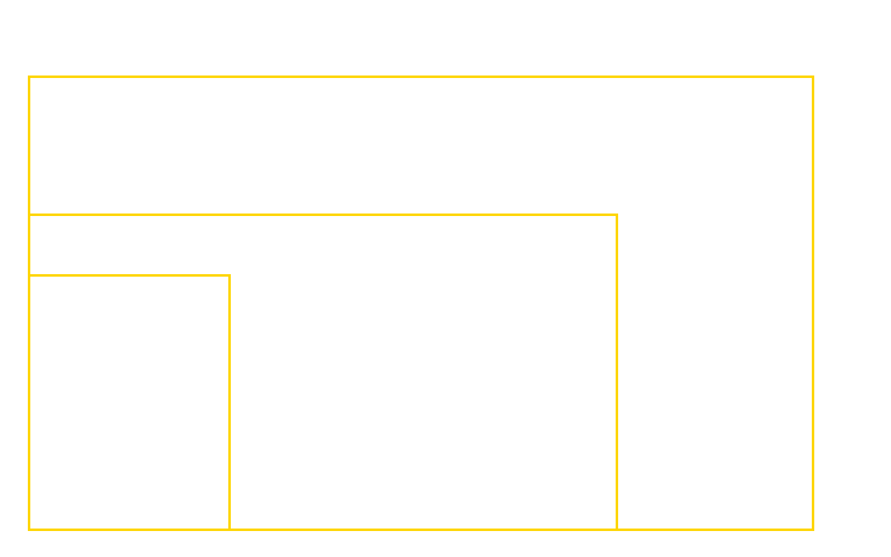

We'll start by choosing some screens or window sizes to support; we'll call these our breakpoints. The purpose of selecting breakpoints is to give us a representative sample of ways that our users will experience our designs.

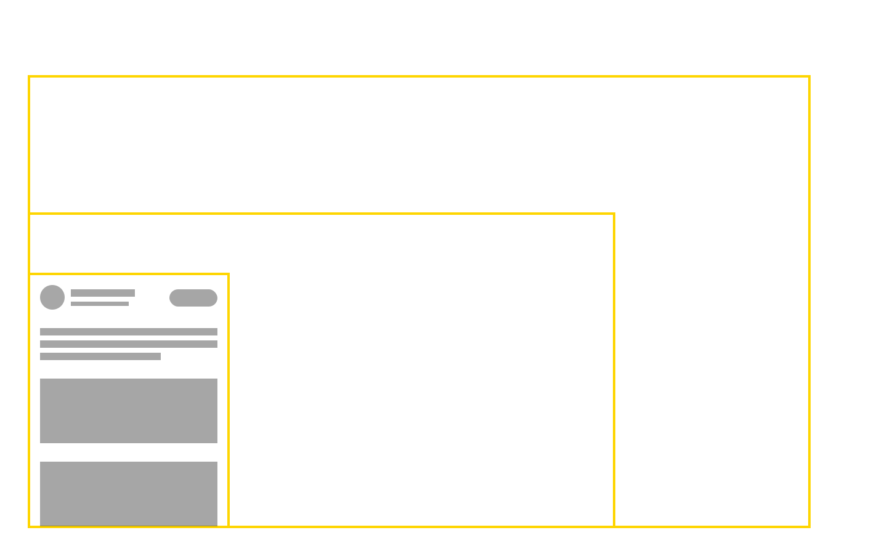

Our designs will start mobile-first, meaning our smallest screens are the default layout; any additional space is treated as a progressive enhancement. Space is not something we can assume we'll have, and it is not required for our designs to work.


But we'll make the most of it when we do have it.


This mobile-first approach can help focus our designs and ensure they work well, first in the more restrictive environments of smaller devices.

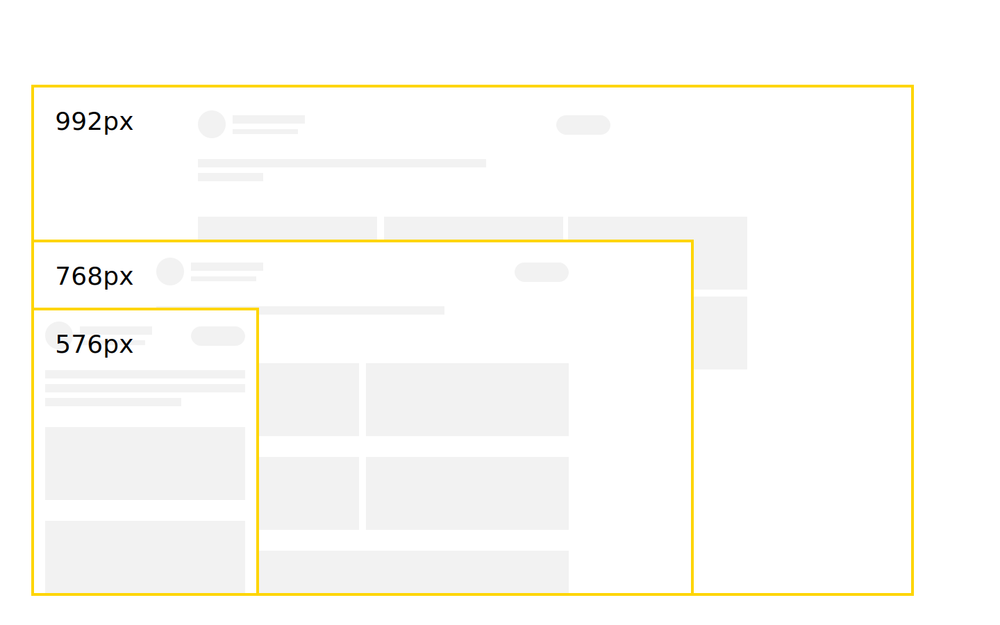

So, let's choose some standard screen sizes and start making our interventions at those points; these are the ones Bootstrap uses.

We may need to make additional interventions and tweaks to our designs between these points once we have our content in... but these are the main changes we'll see.

### Media queries

The magical media query is the next tool we learn about.


Here's what they look like if you've never seen one (this is the only code I'll show today). It seems like an `If` statement because that's basically what it is. Just a conditional check on the current screen width, and then some styles to apply when that condition is met.

In this example, the background of our page is tomato red. The new style is applied if our breakpoint has been reached, setting the background light blue.

We'll want to use our breakpoints to intervene in our design. These media queries are how we achieve new layouts at those breakpoints, but instead of simply changing colors, we conditionally apply new dimensions, positions, and directions to our elements.

### Grid systems and percentage widths

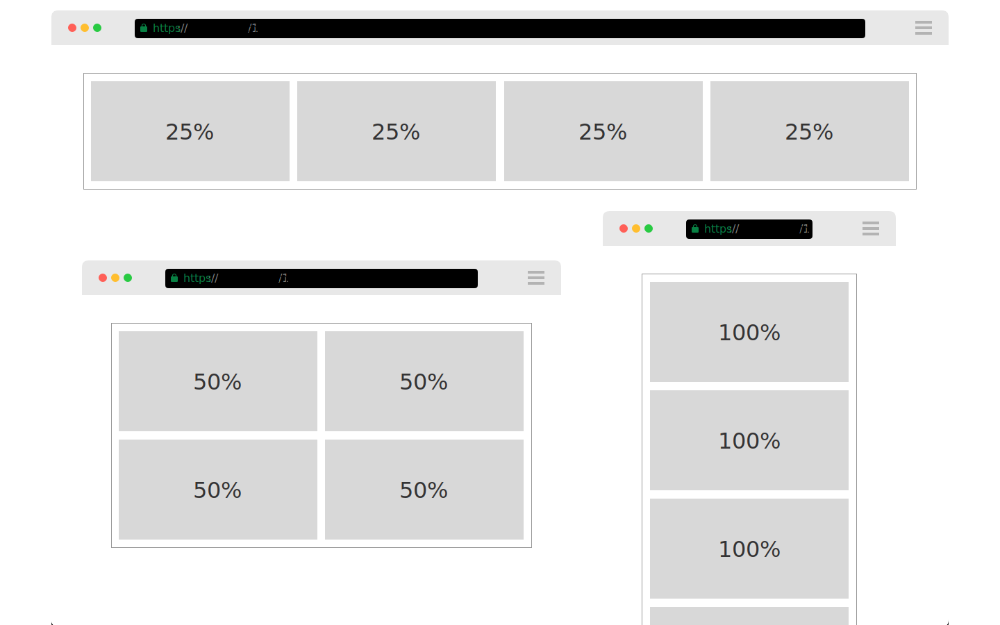

Next, we have percentage widths and the traditional Grid systems you may already know. Hopefully, it's easy to see how we can use media queries to systemize our chosen breakpoints and build something like a traditional responsive grid system.

Responsive Grids allow us to abstract repeatable structures in our designs and divide the space on our page into proportional columns. We use our breakpoints as markers for interventions and choose how to best adapt our content to fit the available space.

Better still, these columns are sized as percentages of the available space, so our columns constantly proportionally adjust and respond between our breakpoints!


## In conclusion?

After we apply these tools to our designs, responsive design has been achieved! 🚢

It's straightforward to build robust and dynamic designs that adapt to our user's needs...almost too easy if you ask me.

Wait, why is the scrollbar only halfway down the page!?

## Be the browsers mentor, not its micromanager

Unfortunately, there are a lot of limitations to these approaches that aren't immediately intuitive, or they weren't to me anyway. Much learning around responsive design starts and ends with the material I've shared.

These techniques are not sufficient and never really were. They're simply the best tools we had for a long time.


Success Criterion 1.4.10 Reflow (Level AA): Content can be presented without loss of information or functionality and without requiring scrolling in two dimensions...


When it comes to supporting a responsive design as an accessibility requirement (not just supporting some arbitrary screen sizes), there are other factors to consider, ones that can't be catered for with these techniques.

The documentation for the reflow success criteria on the Web Accessibility Initiative's accessibility checklist is a good resource for helping to understand what I mean and is well worth reading. Let's examine why this basic responsive approach doesn't solve our reflow problems and why it doesn't scale well.

### Responsive vs. Systematically responsive

The basic approach I've discussed is only really effective where three things are known ahead of time:

1. The **context** of your content (I'll explain what I mean soon)
2. The **content** your designs will contain
3. The way your user has **configured** their browser

When designing responsively at scale, all three of these are unknowns or known to be variable.


When first learning responsive design, we tend to take a print designer's approach, with fixed widths and fixed paper sizes in mind. In reality, we should embrace the fact that the web doesn't have the same constraints as printed page, and design with its flexibility in mind.


#### Why they are unknown

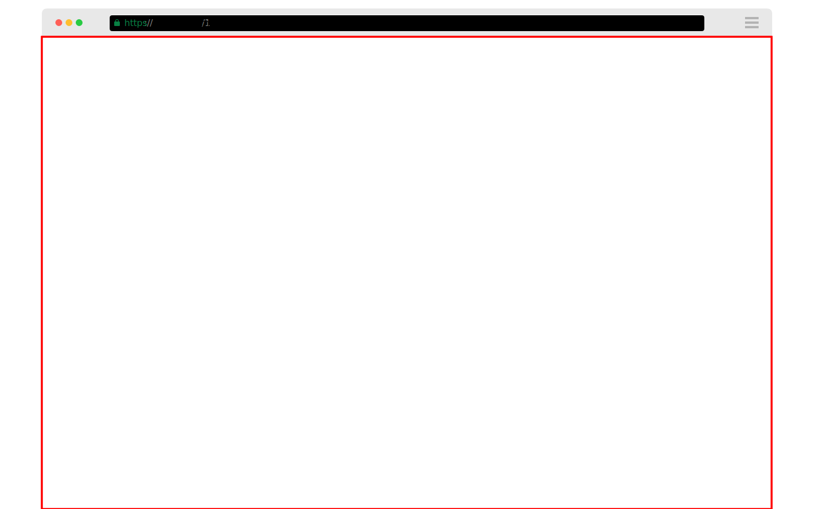

First, there's a subtle difference between your user's **screen size** and your **user's context**.

Highlighted here, you can see "screen size". We have relied on this red box for the condition of all our responsive interventions so far. But Our user's context accounts for a lot more and is independent of screen size in the following ways:

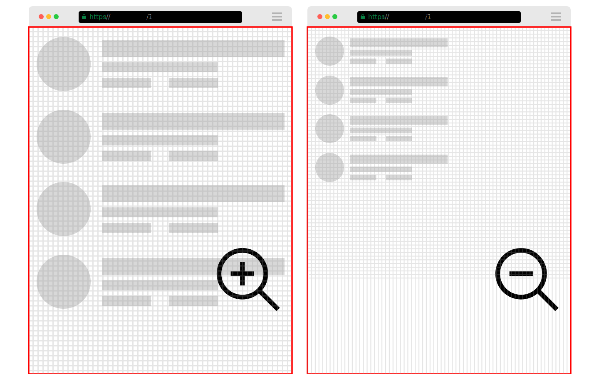

**Zoom** - users have control over the zoom level of the content on their page; notice the screen size doesn't change, but the content does.


**Language** - Secondly, your content will be translated. Translation often leads to different space requirements for the same content. If you've ever found yourself tweaking a fixed width to contain some piece of content exactly, you'll find your German users are now experiencing a lot of unintended truncation or wrapping.


Side note: fixed dimensions are your enemy in responsive design. 🔥


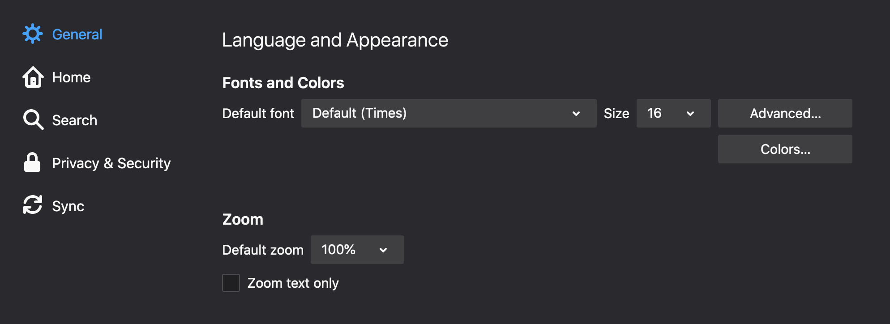

**Base font size/letter spacing** - Another way the space required by your content can change is due to the control the browsers give to the user over what their base font (or body copy) can be, not only altering the dimensions of our content but also potentially affecting visual hierarchy of our designs. These are tools provided as an aid to the accessibility of our websites. We should accommodate this behavior, not fight it.

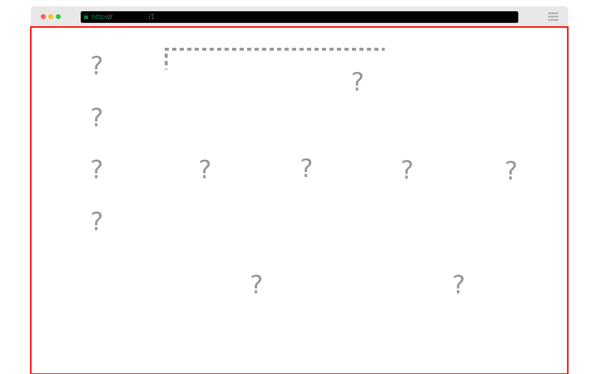

**Position** - when building at scale, you're likely building by composing components. Building components, you should also be aware that you're building containers for variable content in variable contexts.

The position, and as a result, the proportion of the page your component will occupy, is not always knowable or obvious.

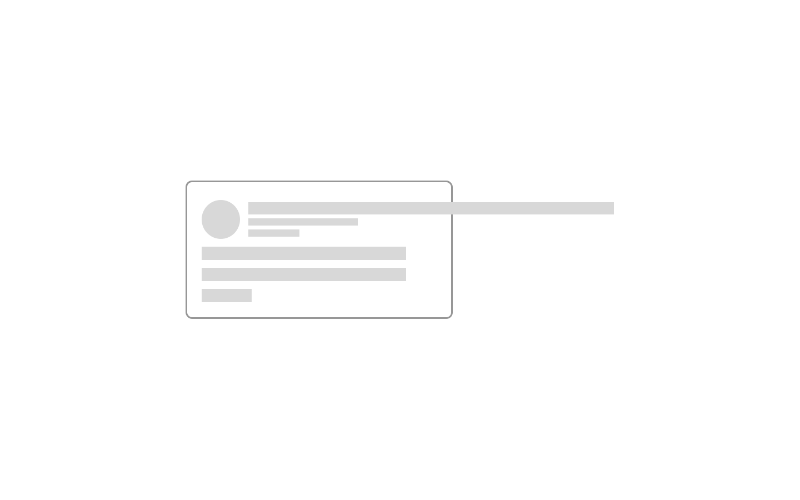

**Dynamic content** - When building systems for others to use and configure, you rarely control the actual content that gets placed inside those systems.

- Zoom
- Language/Internationalization
- Base font size
- Dynamic content

In short, designing responsively without these things in mind will lead to your content and layout being malformed, obscured, truncated, or challenging to consume for someone, probably not you.
An excellent responsive measure of your UI is how it handles this list of variables.

Let's quickly summarize what this means for the old way of being responsive.

### Myth #1 - Our breakpoints are how our users will see our designs


The massive proliferation of devices means there is no actual set of standard dimensions to design for.

As we saw, our selected breakpoints are arbitrary to the point of uselessness and are a very shallow representative sample of our user's context. There are numerous other factors to account for that affect how our users see our designs.

### Myth #2 - Grids and Media queries allow us to adapt our design to best fit the available space

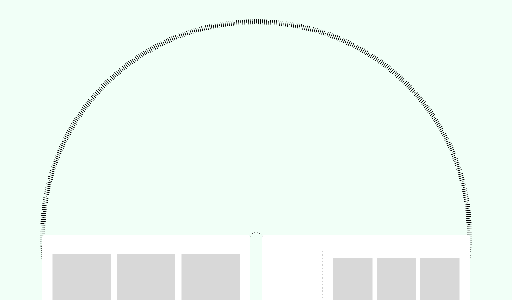

Being squishy alone is not being responsive. Grids and layouts that depend on media queries don't adapt to available space. They adapt only to the screen size they're viewed in.

Because all these variables are unknown, responsive design is ultimately designed for an environment you'll never see.

We must use whatever the content and purpose or intent of our design rather than arbitrary device widths to determine where interventions should be made.

### Myth #3 - Design is aesthetics

> "Design is a plan for arranging elements in such a way as best to accomplish a particular purpose." ― Charles Eames, American designer, architect, and filmmaker

The purpose of design, responsive or not, is not to look nice, not primarily anyway. As old Charlie puts it, design is a plan to purposely arrange elements.

> "**Responsive** Design is a plan for arranging elements in such a way as best to accomplish a particular purpose, **across contexts.**" ― ~~Charles Eames, American designer, architect, and filmmaker~~ - Micheal Scott

Responsive design is an extension of this: maintaining a plan for arranging with purpose across contexts.

### What do you mean by purpose?

To clarify what I mean by purpose. The size, position, and relationship elements have between each other on a page; all this is purposeful. Here are some quick samples of examples related to layout.

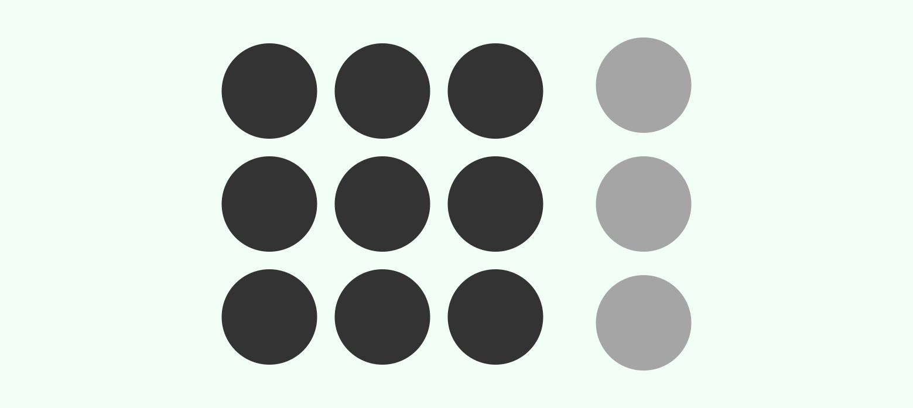

Law of proximity: Objects close to each other are perceived to be related when compared with separated elements. The amount of spacing between elements can be used to denote relatedness.


Line Measure: The width of a line of text, in characters, is known as its measure. Reasonable measure is critical for the comfortable scanning of successive lines of text. Usually, a value between 45 and 75 characters is reasonable. Note this is independent of screen or font size.

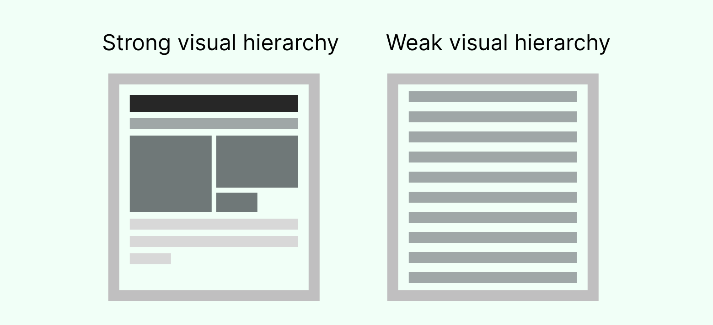

Content Hierarchy: A strong and relative visual hierarchy must be created and maintained. What is most important on the page should be obvious to the user. This applies to typography and the visual impact of the other elements on your page.

#### Example of purpose


Let's look at a simple example to demonstrate purpose in design.
Say we must display 3 pieces of text, each with its own heading.

1. The 3 text elements have equal visual weight because they are equally important.
2. The text elements have a spatial relationship to each other and their headings. They are more related to their headings than to each other.
3. The text and their headings have a size relationship to each other, denoting hierarchy and helping with comprehension.
4. The text remains readable (a sensible minimum and maximum measure should be maintained)

What must the layout that holds this content achieve to retain this original purpose across contexts?

Think back to our unknowns (language, context, font size, zoom, position) and how they can interfere with our intended purpose here.
Making judgments on **when** our layout should adapt to maintain that purpose is not possible when the only adjustments we can make are in relation to screen size.

## 🤷‍♂️

Using traditional interventions to maintain the meaning of our designs is an unachievable task. Absolutely not! We've just been approaching things with the wrong mindset and from the wrong direction.

### What should we respond to?

![2d-parametric-adaptive-floor-plans.gif]

What should we respond to if responding to our user's screen size is not helpful? Your content is the reason your user visits your site, and its accessibility to them should be your primary concern.

But when designing systems or platforms, your content is provided or configured into the product by your customers,

Your designs should try to respond to and maintain the purpose or intent of the layout and be robust enough to gracefully handle the additional variable qualities of both content and context.

### How?

Instead of starting on the outside (our screen size), We can start from the inside and work our way out.

We want to build our designs in a way that minimizes the need for us to intervene. As we've seen, responsive design is designing for an environment you'll never really see anyway.

![3d-adaptive-floor-plans.gif]
To do this, we should think about our layouts as ways to influence our content with tolerances and acceptable ranges.
Think of yourself as the browser's mentor rather than its micro-manager. If we want our layout to be intrinsically responsive to the content and context it is exposed to, we'll need better tools.

## Better tools of the trade

### Rems and Modular scale

TODO - REMAKE (https://blog.prototypr.io/8-rules-for-perfect-typography-in-ui-21b37f6f23ce)


> Display: 3rem
> heading: 2rem
> body: 1rem (16px default)
> overline: 0.8rem
> Starting at the very middle with our text. Rems or root Ems are relative properties where 1 Rem equals one times the default base font size.
> They allow you to build your typographical hierarchy using one or more ratios relative to the base font size. This means if the base font is changed (through user settings or browser plugin), the proportions of your typography scales with it, and therefore, the meaning between your type levels is maintained! You can also use rems in the same way for spacing.

### Flexbox and CSS Grid

These tools are relatively new (5 years) but are well-supported by modern browsers. They allow us to describe layouts with no (or much less) human interventions required.
While Media queries can be viewed as simple **if** statements based on page size, Flexbox/CSS grid can be viewed as mini algorithms or layout machines that are more context/content-aware and allow us to abstract the purpose of our designs in ways that are independent of things out of our control like zoom, language and font size.

### Flexbox

```md
Flexbox lets us:

- [x] Set ideal widths/heights and guard rails for when those ideals cannot be met
- [x] Grow and shrink elements proportionally to each other (maintaining hierarchy and visual impact) or prevent items from growing or shrinking at all.
- [x] Control and context over scoped containers, Independent of the number of elements there will be
```

Flexbox allows us to set ideal or basis widths - without stopping elements from growing and shrinking when appropriate. It also allows us to grow and shrink related elements at given ratios.

We can set the minimum and maximum widths for child elements as percentage values of the parent container width. This allows us to mimic some behavior of container queries, letting elements respond to their own size, not the pages. An example will help demonstrate why all this is useful to us.

#### Flexbox example


The Sidebar rule - a Sidebar is defined as an area of secondary importance to the main area of importance
In layout, it is usually safe to equate real estate with importance, so with that in mind with Flexbox
we can build a layout that behaves like as follows:

- Put "Sidebar" beside the "Main" area, When "Main" is greater than or equal to half the available space (not half the page size).
- When "Sidebar" and "Main" are the same size, "Sidebar" is no longer a sidebar; let's make an intervention and stack these elements instead.

This abstraction of a layout has a purpose and can maintain it, independent of screen size and our other variables.

### CSS Grid

CSS grids differ from traditional ones in that they can be configured to adapt to more complex and dynamic content. They can easily infer what to do with additional elements based on some given criteria.

#### CSS Grid example

```css
.l-grid__inner {
	grid-template-columns: repeat(auto-fill, minmax(15rem, 1fr));
}
```

> 

Here's an example of some ways you can set up a CSS grid.

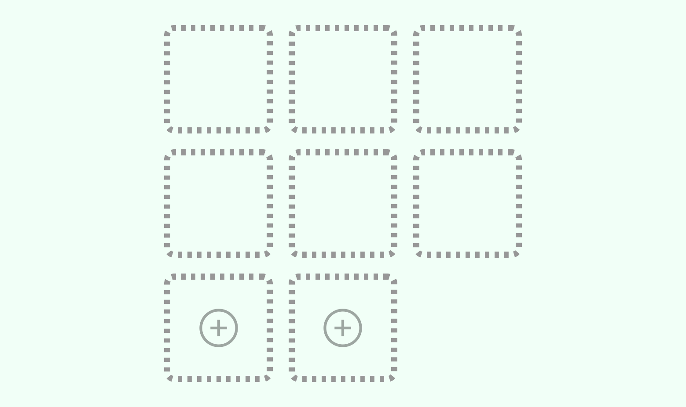

repeat means columns are created on demand to accommodate any number of child elements

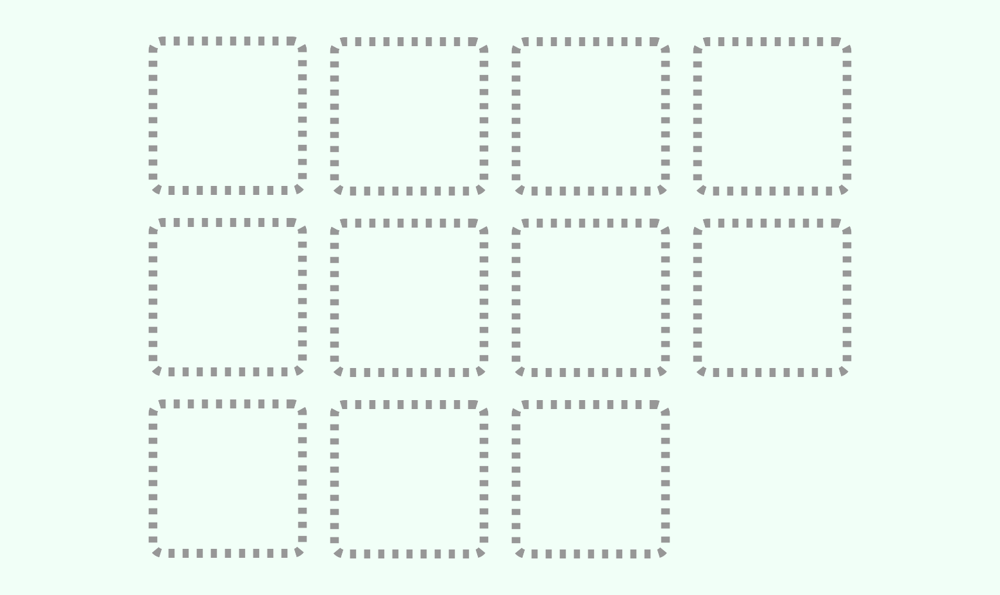

The `auto-fill` property tells the grid that columns can be added or removed if needed depending on the number of elements and the next value which allows us to set a tolerant range for what we consider to be acceptable sizes of those columns.

In this case, the minimum column width is 15 times the base font size (maintaining a readable line measure for contained content). The maximum of 1fr means all columns should then expand and equally share any extra space when available.

### The difference between Flexbox and CSS Grid


You'll commonly use both Grid and Flexbox in combination with each other but if you're ever wondering how to choose between these two tools, this little illustration is all you need.

If you require elements of variable size to behave responsively, **use Flexbox**; examples might include button groups, category tags, or any text-like content.

**Use CSS grid** if you require your elements to maintain uniform sizing and 2 dimensional alignment.

### Container queries


Container queries are a long-awaited, recent addition to the responsive design toolbox. Container queries allow us to apply styles to an element based on the size of the element's container. This seems like our previously maligned Media queries; however, responding to the element's available space rather than the page size is a much more powerful and dependable way to base styling decisions.

```css
@container (min-width: 380px) {
	/* When the card is at least 380px wide*/
	.c-card {
		flex-direction: row; /* change the layout of its content */
	}
}
```

## Inherently responsive patterns

Some patterns are more inherently responsive than others and are worth learning about, too.

![priority-plus.gif]

**Dynamic, progressive disclosure** - The priority plus is one good example. This pattern usually requires JavaScript. It is inherently responsive because it is agnostic to where it's placed, how many items you put in it, or the sizes of those items.

**Scrollable tabs** -

**Let it wrap** - More of a principle than a pattern but

I hope this helped give an idea of the problems and solutions that exist in the responsive design space if you're starting out.
If you're interested in learning more, I highly recommend a book called [Every Layout](https://every-layout.dev/) by Heydon Pickering and the indispensible resource that is [buildexcellentwebsit.es](https://buildexcellentwebsit.es/) by Andy Bell.

Thanks for reading this far!
